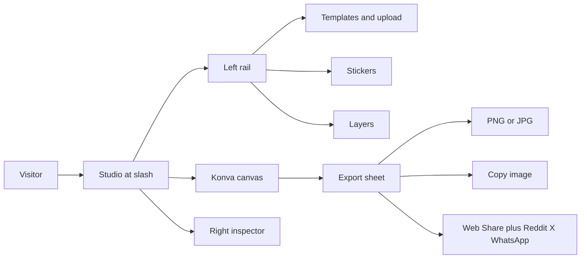

# Atelier — premium meme studio

A still-image meme maker with Imgflip’s workflow and a much higher visual and interaction bar. No accounts, no GIFs, no AI. Instant editor at `/`.

## Product snapshot

- **Name:** Atelier
- **Loop:** pick template or upload → customize on canvas → export/share
- **Chrome:** dark cinematic studio (charcoal, hairline borders, amber gold `#E8B86D`, bone text `#F5F2EA`)
- **Voice:** quiet luxury — short labels, no clown copy. Humor lives in the meme, not the UI
- **Motion:** 150–220ms fades and panel slides only
- **Watermark:** discreet “Atelier” wordmark, **on by default**, togglable in the export sheet
- **Content:** SFW curated/popular catalog + user uploads; no NSFW category

## Stack

- **Next.js App Router + TypeScript + Tailwind CSS v4**
- **react-konva / Konva** for the canvas (dynamic import, `ssr: false`)
- **Zustand + zundo** for editor state and undo/redo
- **idb-keyval** for autosave drafts (no auth)
- **lucide-react** for icons
- **next/font:** Instrument Sans (UI) + Newsreader (wordmark) + a curated meme-font pack (Anton as Impact-class default, plus ~18 faces: Oswald, Bebas Neue, Inter, Geist fallback, Playfair, Oswald, Comic Neue, Permanent Marker, Bangers, etc.)

Konva is required for precise drag, resize, rotate, crop, draw strokes, filters, and pixel-accurate export. DOM-to-image is not good enough for this editor.

## Information architecture

**Desktop (hero experience)** — Figma-like three panes:

- **Top bar (44px):** Newsreader wordmark “Atelier”, template name, undo/redo, zoom, primary **Export** button in amber
- **Left rail (~280px):** segmented control `Templates | Stickers | Uploads`; search; gallery; **Layers** list pinned at the bottom (visibility, lock, reorder)
- **Center:** infinite charcoal stage, meme on a raised card with a 1px border, letterboxed; center-snap guides; wheel zoom; space-pan; fit-to-screen
- **Right inspector (~320px):** glass panel (`rgba(22,22,24,0.86)` + blur). Context-sensitive. Empty selection shows canvas/template controls (crop, flip, rotate, filters, add panel)

**Mobile (first-class, not a shrunk desktop):**

- Full-bleed canvas
- Compact top bar (wordmark + undo + Export)
- Bottom dock: Templates, Text, Stickers, Draw, Layers, Adjust
- Inspector and libraries as 60–80vh bottom sheets
- Tap object → transformer; tap outside → hide handles (Imgflip’s mobile rule, done cleanly)

## Core data model

Single Zustand document, autosaved to IndexedDB:

- `panels[]` — meme-strip cells. Each has `id`, `src`, natural size, crop, flip, rotation, filters (`brightness`, `contrast`, `blur`, `grayscale`, `sepia`, `invert`)
- `objects[]` — `text` | `sticker` | `image` | `stroke`. Each has `panelId`, transform, opacity, locked, zIndex
- Text: content, fontFamily, fontSize, fill, stroke, strokeWidth, shadow, align, uppercase, letterSpacing, lineHeight
- Stroke: points, color, width, tool (`pen` | `highlighter` | `eraser`)
- `selection`, `tool`, `zoom`, `exportSettings` (`format`, `scale` 1x|2x, `quality`, `watermark`)

**Text boxes:** templates declare `box_count`. 2 boxes → classic top/bottom. 3+ → evenly stacked with padding. User can add unlimited extra boxes.

**Meme strips:** Add panel above / below / left / right. Stage size = concatenated panel bounds. Objects stay bound to their panel. This is Imgflip’s “meme chain” without a grid-preset system.

## Templates

Imgflip’s public `GET https://api.imgflip.com/get_memes` returns ~100 popular SFW-leaning templates (id, name, url, width, height, box_count). We **do not** use `/caption_image` — that would throw away our editor. We **do not** scrape their 1M library.

Implementation:

- Local overlay [`lib/templates/catalog.ts`](lib/templates/catalog.ts): aliases, categories (`Classic`, `Reaction`, `Movies`, `Animals`, `Blank`), recommended box layouts, SFW denylist by id/name
- Blank presets: 1:1, 4:5, 9:16, 16:9, plus solid/gradient empties
- User upload: file or URL, client-side type/size checks
- **CORS:** canvas export taints cross-origin images. Next.js route [`app/api/proxy-image/route.ts`](app/api/proxy-image/route.ts) allowlists `i.imgflip.com` / `api.imgflip.com`, caches aggressively, returns the bytes. Trending list via [`app/api/templates/route.ts`](app/api/templates/route.ts) wrapping `get_memes` + overlay
- Left gallery: cinematic tiles, search, category chips, “Trending” from API, upload tile first. Hover: slow scale + name, no bounce

If Imgflip blocks or rate-limits, the curated overlay + blanks + upload still work.

## Editor capabilities (v1)

**Selection and transform**

- Konva `Transformer` with proportional text resize (scale maps to `fontSize`, then scale reset)
- Nudge with arrows (Shift = 10px)
- Duplicate, delete, lock, bring forward/back
- Center and edge snap guides

**Typography (Imgflip parity, tastier defaults)**

- Live textarea in the inspector; double-click on-canvas to edit (Konva Html overlay)
- Fill + outline + outline width (classic white/black Impact look). Konva’s centered stroke is weak — render outline via a dedicated high-quality text drawer (offset-stamp or `canvas` measure + multiple fills) so thick meme outlines look correct
- Shadow, opacity, alignment, all-caps, letter spacing
- Curated font picker with specimens, not a 1,300-font dump
- Default: Anton, uppercase, center, white fill, 8–12px black outline

**Stickers**

- ~18 original SVG/PNG assets we draw ourselves (not Imgflip’s): deal-with-it glasses, cap, crown, speech bubbles (3), arrows, sparkles, “X”, heart, fire, sunglasses, thought bubble, banner, pointing hand
- Opacity, flip, rotate, resize
- Uploads can be dropped as extra image objects (poor-man’s custom sticker)

**Crop / flip / rotate / filters**

- Template crop via an overlay editor (aspect lock, apply/cancel)
- Flip H/V, 90° rotate
- Konva filters on cached image nodes: grayscale, sepia, invert, brightness, contrast, blur. Keep the list short and the sliders cinematic (not a 1999 effects dump)

**Draw**

- Pen, highlighter (transparent), eraser
- Size + color
- Each stroke is a layer object (selectable, undoable, deletable)
- No brushes, no stabilizer v1

**History**

- zundo temporal store, ~50 entries
- Cmd+Z / Shift+Cmd+Z
- Autosave draft; restore on return; “New meme” clears document

**Keyboard:** T add text, V select, P draw, Delete, Cmd+D, Cmd+E export, [ ] z-order, 0 fit, space pan

## Export and share

Export sheet (modal, dark glass):

- Preview at actual crop
- PNG / JPG, 1x / 2x
- Longest edge: native, capped at **2048px unless the source upload is larger**
- Watermark toggle (default on) — small Newsreader “Atelier” bottom-right at ~40% opacity, never on the working canvas
- **Download**, **Copy image** (`ClipboardItem`)
- **Share:** `navigator.share` with a `File` when available (the real mobile path). Desktop: Reddit / X / WhatsApp buttons copy the image then open the platform compose URL. No hosted CDN, so we cannot attach the file to those sites directly — the UI copy stays honest (“Image copied. Paste into your post.”)

## Visual system (tokens)

- Background `#0B0B0C`, surface `#121214`, raised `#18181B`
- Hairline `rgba(245,242,234,0.08)`, focus ring amber at 40%
- Muted `#8A8680`, danger `#E07464`
- Radius: 10px controls, 16px sheets, 2px on the canvas card (sharp, not bubbly)
- Type: 12px tracked-wide labels, 13–14px controls, no rainbow hover states
- Selection chrome: amber handles, 1px bone outline
- Scrollbars: thin, on-surface

Reference density: Linear settings + Figma inspector, not Canva’s candy UI.

## File map

- [`app/layout.tsx`](app/layout.tsx) — fonts, metadata “Atelier — Meme studio”, dark only
- [`app/page.tsx`](app/page.tsx) — studio shell
- [`app/api/templates/route.ts`](app/api/templates/route.ts)
- [`app/api/proxy-image/route.ts`](app/api/proxy-image/route.ts)
- [`components/studio/StudioShell.tsx`](components/studio/StudioShell.tsx)
- [`components/studio/TopBar.tsx`](components/studio/TopBar.tsx)
- [`components/studio/LeftRail.tsx`](components/studio/LeftRail.tsx)
- [`components/studio/LayerList.tsx`](components/studio/LayerList.tsx)
- [`components/studio/Inspector.tsx`](components/studio/Inspector.tsx)
- [`components/studio/CanvasStage.tsx`](components/studio/CanvasStage.tsx)
- [`components/studio/ExportSheet.tsx`](components/studio/ExportSheet.tsx)
- [`components/studio/MobileDock.tsx`](components/studio/MobileDock.tsx)
- [`components/studio/CropOverlay.tsx`](components/studio/CropOverlay.tsx)
- [`lib/store.ts`](lib/store.ts) — document + history
- [`lib/templates/`](lib/templates/) — catalog overlay, blanks
- [`lib/export.ts`](lib/export.ts) — pixelRatio, watermark composite, clipboard, share
- [`lib/fonts.ts`](lib/fonts.ts)
- [`public/stickers/`](public/stickers/) — original sticker assets

## Implementation sequence

1. Scaffold Next.js app, tokens, fonts, three-pane shell (empty panes, mobile dock breakpoint `lg`)
2. Zustand document + Konva stage: one image, two text boxes, transformer, undo
3. Template rail + API + image proxy + search/categories/upload
4. Inspector typography + font pack + high-quality outline text
5. Layers, stickers, uploads-as-objects
6. Crop, flip, rotate, filters
7. Draw tools
8. Multi-panel strips
9. Export sheet (PNG/JPG, 1x/2x, watermark, clipboard, share buttons)
10. Autosave, keyboard, snap guides, empty/error states
11. Mobile sheets polish
12. Browser verification of the real user flow (below)

## Browser verification (required)

Using the in-editor browser against the local Next server:

1. Desktop: pick a trending template → type top/bottom → drag/resize → change font/outline → export PNG with watermark on and off
2. Upload a custom image → crop → grayscale → add sticker → draw an arrow → undo
3. Add a panel below, caption both, download 2x JPG, copy to clipboard
4. Mobile viewport: open template sheet, add text, export, confirm dock + sheets (not a cramped three-pane)
5. Share sheet: confirm copy + compose-tab behavior
6. Reload: draft restores. New meme: canvas clears

## Out of scope for v1

GIFs/video, AI captions, accounts/cloud, hosted share URLs, Imgflip communities, 1M-template search, NSFW, light theme, comic grid presets, pressure brushes.
